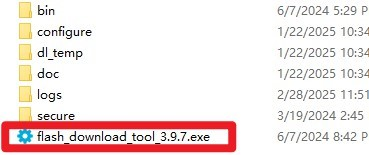
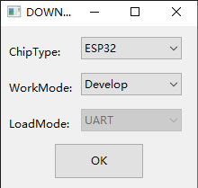
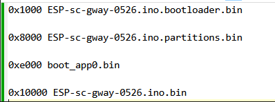
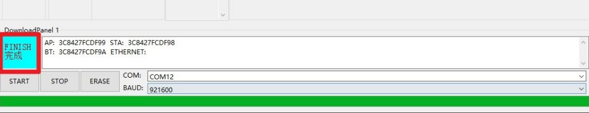

## The Wi-Fi connection password for Lora_Gateway_release_bin_v1.0 is 12345678.

## The Wi-Fi connection password for Lora_Gateway_release_bin_v2.0 is aaaabbbb.

## The firmware of zheg wifi-test can test whether your device's Wi-Fi is working properly. The Wi-Fi name is "ESP32 AP" and the password is "aaaabbbb". After connecting, check whether there is an IP address output on the serial port. If there is, it is working properly.

# How to install the factory demo firmware with flash download tool?

#### 1.Preparation:

- USB C cable
- Laptop/PC
- LoRaWAN Gateway Module Based on ESP32 with 1.8” LCD
- Flash download tool

Check whether the materials on the PCBA board are defective. Such as less material, false welding, tin and other bad phenomena.

#### 2.Flash the firmware 

##### Step1 LoRaWAN Gateway Module to the laptop/PC with USB-C cable. The power indicator will light up.

##### Step2 Open the flash download tool. 

For the  Crowpanel Advance HMI ESP32 AI Display, the chip select ESP32:

##### Step3

①Choose the firmware files;

②Enter the address: 

③Check the firmware files;

④Select the correct port number;

⑤Click “Start” to download

##### Step5 After the download is complete, blue FINISH will be displayed, and the progress bar at the bottom shows that it has come to an end.

