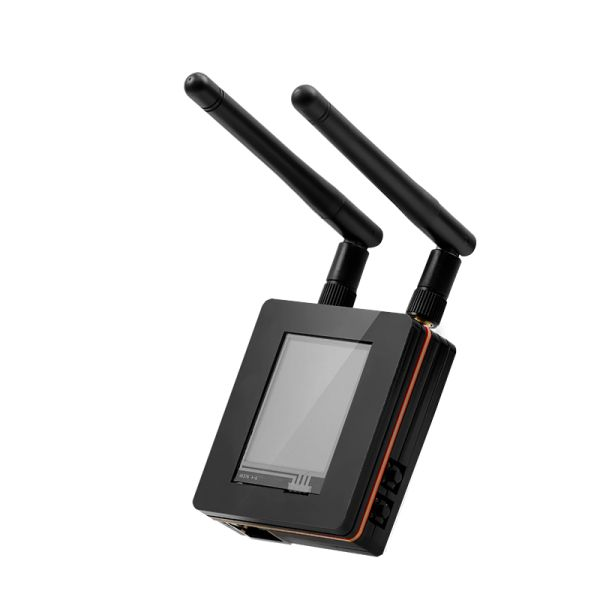
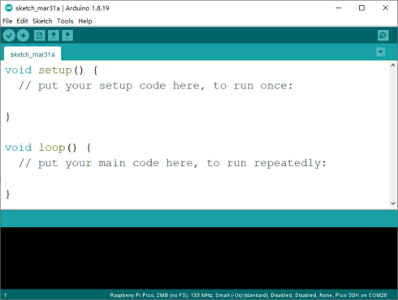
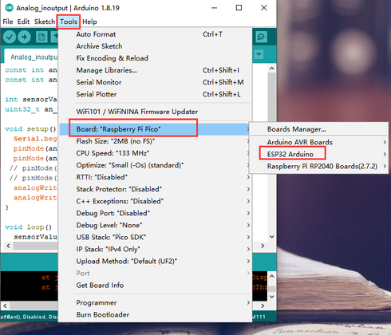

### 1, Product picture

### 2, Product version number

|      | Hardware | Software | Remark |
| ---- | -------- | -------- | ------ |
| 1    | V1.0     | V1.0     | latest |

### 3, product information

- | Main Processor Chip              | ESP32 WROOM32 with dual-core 32-bit LX6 microprocessor from Xtensa @ 240MHz |
  | -------------------------------- | ------------------------------------------------------------ |
  | LoRa RF transceiver module       | RA-01H                                                       |
  | RA-01H Supports frequency band   | 803MHZ-930MHZ                                                |
  | RA-01H Support modulation method | FSK、GFSK、MSK、LoRa                                         |
  | Channel                          | Single channel                                               |
  | Support Lorawan protocol         | Support Lorawan 1.0.3                                        |
  | WiFi Antenna                     | SMA 2.4G WiFi Antenna                                        |
  | Communication distance           | Obstructed state: up to 1 kmUnobstructed state: up to 1.8 kilometers |
  | Development environment          | Arduino/Micropython                                          |
  | Interface and function           | 1x USB-C interface,1x Ethernet Interface,1x Boot Button,1x Reset Button,2x Indicator Lights. |
  | Working input voltage            | USB DC-5V                                                    |
  | Operating Temperature            | -10°C ~ 65°C                                                 |
  | Dimensions                       | 65mm(L)x58mm(W)                                              |

### 4,Quick Start

##### Arduino IDE starts

1.Download the library files used by this product to the 'libraries' folder.

C:\Users\Documents\Arduino\libraries\

2.Open the Arduino IDE

3.Open the code configuration environment and burn it

### 5,Folder structure.

|--Datasheet: Includes datasheets for components used in the project, providing detailed specifications, electrical characteristics, and pin configurations.

|--Eagle_SCH&PCB: Contains **Eagle CAD** schematic (`.sch`) and PCB layout (`.brd`) files. These are used for circuit design and PCB manufacturing.

|--example: Provides example code and projects to demonstrate how to use the hardware and libraries. These examples help users get started quickly.

|--factory_firmware: Stores pre-compiled factory firmware that can be directly flashed onto the device. This ensures the device runs the default functionality.

|--factory_sourcecode: Contains the source code for the factory firmware, allowing users to modify and rebuild the firmware as needed.

### 6,Pin definition

**IO port definition**

| GPIO0  | BOOT        | GPIO1  | TXD0      | GPIO2  | RXD0      |
| ------ | ----------- | ------ | --------- | ------ | --------- |
| GPIO3  | RXD0        | GPIO4  | LCD_DC    | GPIO5  | DATA      |
| GPIO6  | NC          | GPIO7  | NC        | GPIO8  | NC        |
| GPIO9  | NC          | GPIO10 | NC        | GPIO11 | NC        |
| GPIO12 | RA_RST      | GPIO13 | RA_DIO1   | GPIO14 | RA_NSS    |
| GPIO15 | XP_CS       | GPIO16 | LCD_BLK   | GPIO17 | RMII_CLK  |
| GPIO18 | ETH_MDIO    | GPIO19 | RMII_TXD0 | GPIO20 | NC        |
| GPIO21 | RMII_TX_EN  | GPIO22 | RMII_TXD1 | GPIO23 | ETH_MDC   |
| GPIO24 | NC          | GPIO25 | RMII_RXD0 | GPIO26 | RMII_RXD1 |
| GPIO27 | RMII_CRS_DV | GPIO28 | NC        | GPIO29 | NC        |
| GPIO30 | NC          | GPIO31 | NC        | GPIO32 | MOSI      |
| GPIO33 | SCK         | GPIO34 | RA_BUSY   | GPIO35 | MISO      |
| GPIO36 | NC          | GPIO37 | NC        | GPIO38 | C         |
| GPIO39 | PEN         |        |           |        |           |

